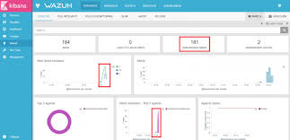

# Wazuh SIEM Deployment & Threat Monitoring

**Project Overview**  
Deployed and configured Wazuh (an open-source Security Information and Event Management - SIEM) platform for centralized log monitoring, intrusion detection, and security event management.

**Tools & Technologies**
- Wazuh Manager
- Wazuh Agents (on Linux and Windows VMs)
- Kali Linux
- File Integrity Monitoring (FIM)

**Key Activities**
- Installed and configured Wazuh Manager and multiple Agents
- Set up log monitoring for authentication logs and system events
- Configured File Integrity Monitoring to detect unauthorized changes
- Created custom alerts for suspicious activities

**Screenshots**

**Key Achievements**
- Detected simulated brute-force attacks on SSH
- Monitored root login attempts and file modifications
- Visualized security events through the Wazuh dashboard

**Skills Demonstrated**
- SIEM deployment and configuration
- Log analysis and correlation
- Intrusion Detection
- Alert tuning and monitoring

**Learning Outcome**  
Gained practical experience with enterprise-grade security monitoring tools used in real SOC environments.
